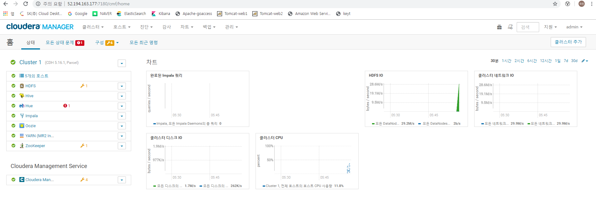

# Install CDH Cluster

### 1. Start Cloudera Manager Server
<pre>
chmod -R 777 /var/lib - 모든 호스트에서 수행
</pre>

<pre>
sudo systemctl start cloudera-scm-server

sudo tail -f /var/log/cloudera-scm-server/cloudera-scm-server.log
</pre>

### 2. Server 접속
<pre>
http://"server_host":7180
</pre>

### 3. 서비스 구성

<pre>
Specify hosts for your CDH cluster installation
Select Repository
Accept JDK License
Single User Mode
Enter Login Credentials
Install Agents
Install Parcels
Inspect hosts for correctness
</pre>

