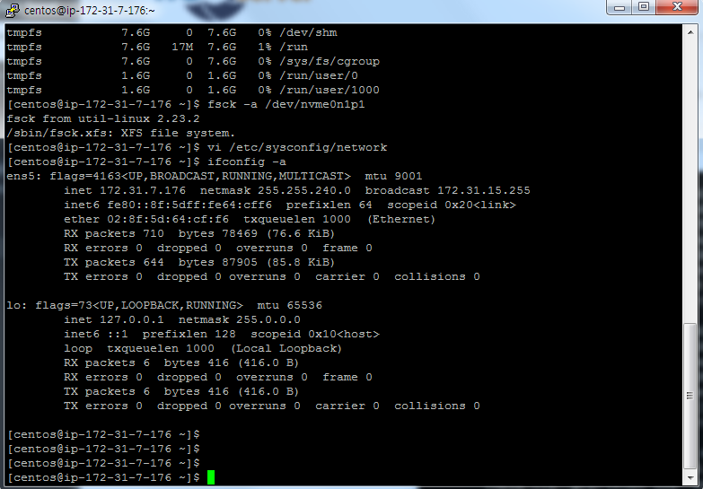

# System Configuration Checks

### 1. swappiness
<pre>
sudo sysctl vm.swappiness=1
</pre>
<pre>
sudo vi /etc/sysctl.conf
vm.swappiness = 1
</pre>

### 2. attributes mount
<pre>
df -h
Filesystem      Size  Used Avail Use% Mounted on
/dev/nvme0n1p1  100G  899M  100G   1% /
devtmpfs        7.6G     0  7.6G   0% /dev
tmpfs           7.6G     0  7.6G   0% /dev/shm
tmpfs           7.6G   17M  7.6G   1% /run
tmpfs           7.6G     0  7.6G   0% /sys/fs/cgroup
tmpfs           1.6G     0  1.6G   0% /run/user/0
tmpfs           1.6G     0  1.6G   0% /run/user/1000
</pre>

### 3. ext-based check
<pre>
fsck -a /dev/nvme0n1p1
fsck from util-linux 2.23.2
/sbin/fsck.xfs: XFS file system.
</pre>

### 4. Disable transparent hugepage support
<pre>
$ cat /sys/kernel/mm/transparent_hugepage/enabled
[always] madvise never ([always] 에 대괄호가 있으면 실행 중)

$ sudo tuned-adm profile network-latency
$ cat /sys/kernel/mm/transparent_hugepage/enabled
always madvise [never]
</pre>

### 5. list your network
<pre>
 ifconfig -a 
</pre>

### 6. list your network
<pre>
getent hosts
</pre>
<pre>
 sudo yum install bind-utils net-tools -y
 nslookup 15.164.82.192
</pre>
<pre>
 $ sudo vi /etc/hosts

172.31.7.176  host1
172.31.3.92  host2
172.31.10.109 host3
172.31.2.211  host4
172.31.5.139  host5
</pre>

### 7. show the nscd service
<pre>
[centos@ip-172-31-3-92 home]$ ps -ef | grep nscd
centos   20162 12193  0 05:01 pts/0    00:00:00 grep --color=auto nscd
</pre>

### 8. show the ntpd serivce
<pre>
[centos@ip-172-31-3-92 home]$ ps -ef | grep nptd
centos   20164 12193  0 05:01 pts/0    00:00:00 grep --color=auto nptd
</pre>

